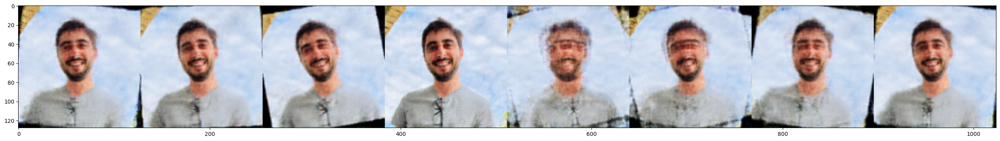
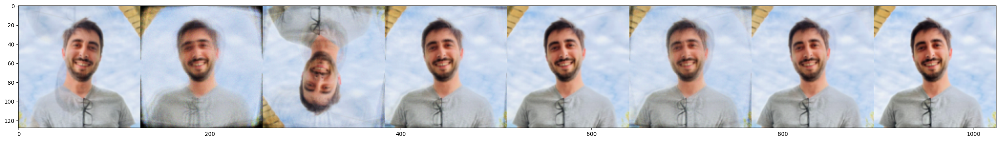

# DIFMI

Generative models experiments for generating a new [Miguel (joabreu)](https://github.com/joabreu).

## Setup

```bash
poetry install
```

## Models

- **VAE with DNN-based Encoder/Decoder**: `src.models.vae.LinearModel`
- **VAE with CNN-based Encoder/Decoder**: `src.models.vae.CNNModel`

All experiments are available in Jupyter Notebook `difmi.ipynb`.

## Notes

A single image was used for training, image augmentation using `torchvision` was performed to enhance results.

## Results

### CNN-based VAE



### Linear-based VAE


